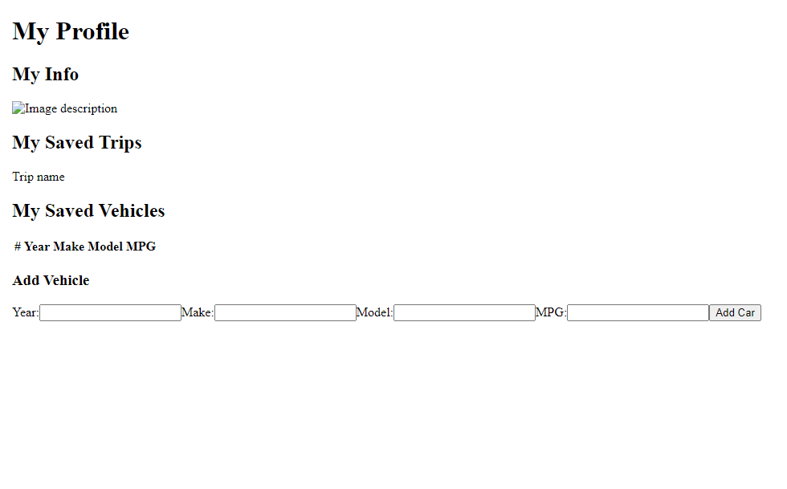

****NOTES ON SECURING API KEYS****
Create an environment configuration file: In your Angular project, create an environment configuration file for storing environment-specific variables. By default, Angular provides two environment files: environment.ts for development and environment.prod.ts for production.

Store your API key in the environment configuration file: Open the appropriate environment file (environment.ts for development or environment.prod.ts for production) and add a variable to store your API key.
For Example:
export const environment = {
  production: false, // Set this to true in environment.prod.ts
  apiKey: 'YOUR_API_KEY_HERE',
}; 

Access the API key in your code: Import the environment object where you need to access the API key, and then access it using environment.apiKey. 
For Example:
import { environment } from '../environments/environment';

// Access the API key
const apiKey = environment.apiKey;

Add environment configuration files to .gitignore: To prevent environment-specific files from being pushed to GitHub, add the environment configuration files (e.g., environment.ts, environment.prod.ts) to your .gitignore file. This ensures that these files are not included in your Git repository.

Note: Make sure to keep a backup of these files and provide instructions on how to set up the environment configuration when someone clones the project.

Set environment variables in your deployment environment: When deploying your application to a production server or hosting platform, you'll need to set the environment variables separately in that environment. The exact process depends on the deployment method you choose.

Happy coding ya'll

# AlongthewayFrontend

